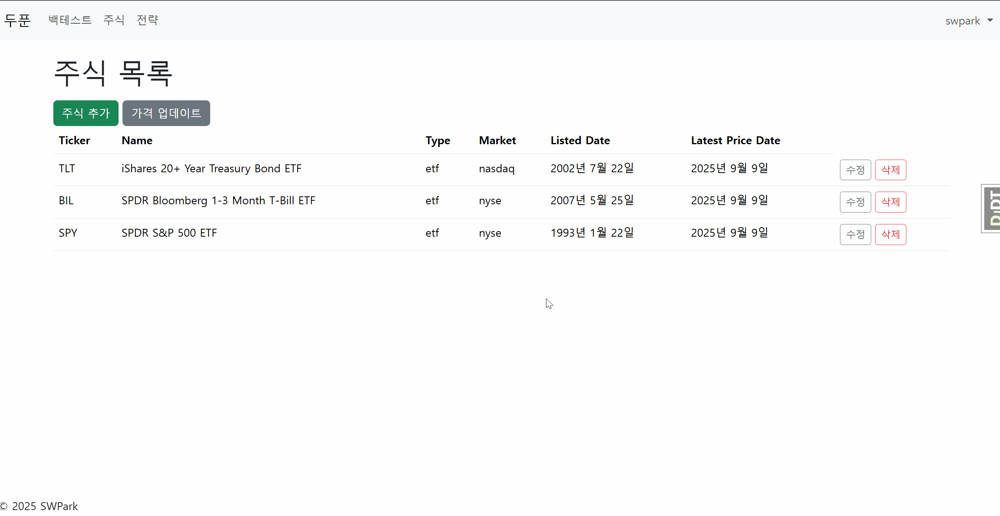
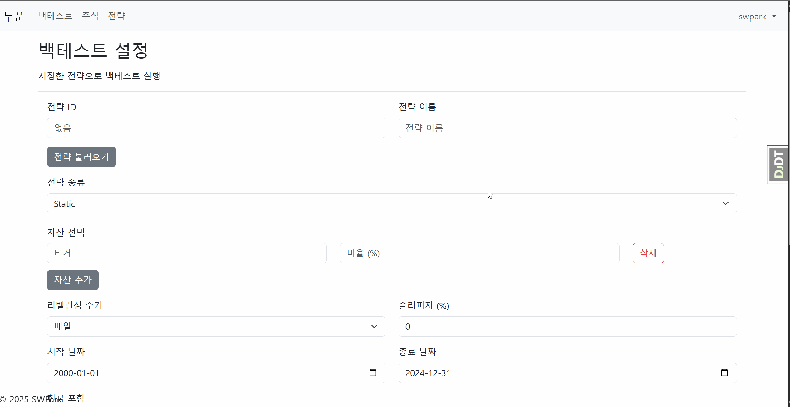

# 📈 두푼

> 두푼은 다양한 정적 자산 배분 전략을 웹에서 백테스팅하고 결과를 시각화하는 서비스입니다.

 <br>

## ☀️ 프로젝트 소개

정적 자산 배분 전략은 장기적으로 안정적이고 간단한 자산 배분 전략입니다. 두푼은 이러한 자산 조합을 간단하게 테스트할 수 있는 기능을 제공합니다.

두푼을 통해 사용자는 종목 코드(ticker)를 입력하고, 배분 비율을 설정하기만 하면 쉽게 과거 데이터를 통해 전략을 시험해볼 수 있습니다.

<br>

## ⭐ 주요 기능

**데이터 수집**: 사용자가 지정한 종목을 바탕으로 yfinance 라이브러리를 이용해 자동으로 주가 데이터를 수집합니다.

<br>

**정적 전략 백테스트**: 저장한 종목에 대한 정적인 자산 배분 전략을 지정하고, 백테스트를 실행합니다.

<br>

**전략 저장 및 결과 조회**: 백테스트 결과를 시각화하고, 전략과 백테스트 결과를 저장할 수 있습니다.

<br>

## 🚀 설치 및 실행 방법

1. **레포지토리 클론**

   ```bash
   git clone https://github.com/SungwooPark5/DuPoon
   cd DuPoon
   ```

2. **환경 변수 설정**
   <br>
   `.env.example`을 복사하여 `.env` 환경변수 파일을 생성합니다. 파일 생성 완료 후 django secret key를 설정해야 합니다.

   ```bash
   cp .env.example .env
   ```

   [Djecrety](https://djecrety.ir/)에서 생성한 secret key를 `.env`에 입력하여 시크릿 키를 지정할 수 있습니다.

   ```bash
   # .env
   DJANGO_SECRET_KEY=""
   ```

3. **실행**
   <br>
   클론한 디렉토리로 이동하여 아래 명령어를 통해 서버를 실행합니다.
   ```bash
   docker compose -f docker-compose-asgi.yml up -d
   ```
4. **웹 서비스 접속**
   <br>
   브라우저를 열고 `http://localhost:8000`으로 접속합니다.

<br>

## 🛠️ 기술 스택

Frontend


Backend


Database


Infrastructure


<br>

## 📜 라이선스

이 프로젝트는 [MIT 라이선스](./LICENSE)를 따릅니다.
